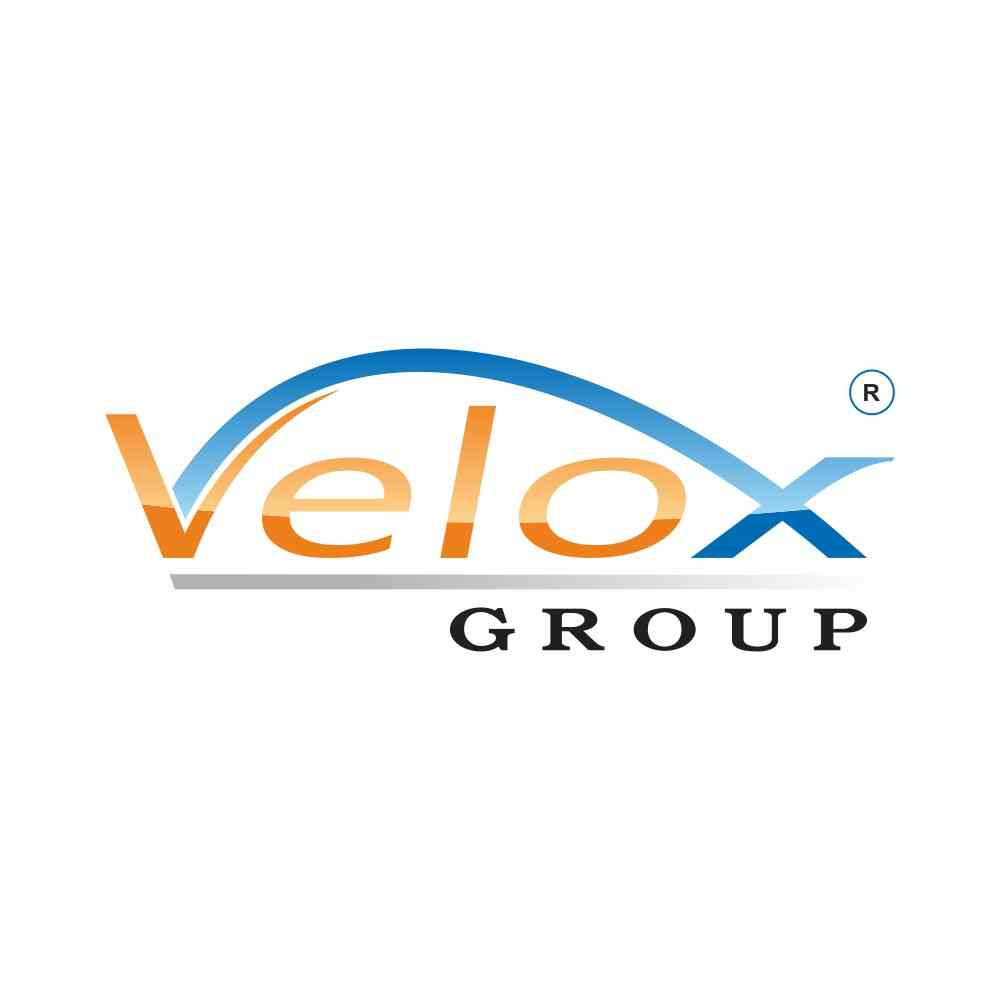

# Velox Website




Velox is not just a website; it's a dynamic and interactive platform designed to redefine user engagement. With a sleek design, seamless functionality, and user-friendly interface, Velox makes managing content efficient and enjoyable.

## Features

### Navbar
- A static-positioned navbar to navigate through the website effortlessly.
- Includes a user icon that displays user details with a single click, offering a personalized experience.

### Dashboard
- A modern dashboard page with a header and intuitive navigation.
- Displays real-time information such as the count of logged-in users, keeping administrators informed.

### Admin Panel
- A powerful admin panel to manage sliders (add/edit/delete) with titles, descriptions, and images.
- Simplifies content management with an option to select image files directly for work items.

### Slider
- Dynamic and visually appealing sliders on the dashboard with images, titles, and descriptions.
- Easy updates via the admin panel, with data securely stored in a database.

### User Details
- Displays user-specific details with a single click on the user icon in the navbar, enhancing interactivity.

### Work Items
- Seamlessly showcases all added work items on both the admin page and the main website (web.html).
- A professional presentation of projects and tasks for visitors and admins alike.

## Technologies Used
- **Frontend:** HTML, CSS, JavaScript
- **Backend:** Node.js with Express
- **Database:** MySQL

## File Structure
```
Velox/
├── public/
│   ├── css/
│   │   └── styles.css
│   ├── js/
│   │   └── script.js
│   └── images/
│       └── logo.jpg
├── views/
│   ├── admin.html
│   ├── dashboard.html
│   └── web.html
├── server.js
├── package.json
└── README.md
```

## Installation and Setup
1. Clone the repository.
2. Install dependencies using `npm install`.
3. Set up the MySQL database and update the database connection settings in the code.
4. Run the server using `node server.js`.
5. Access the website on `http://localhost:2000`.

## Contribution
Contributions are welcome! Be a part of Velox's journey—fork the repository and submit a pull request with your improvements.

## License
This project is open-source and available under the [MIT License](LICENSE).

---

Velox: Where innovation meets simplicity. Elevate your online presence today!
